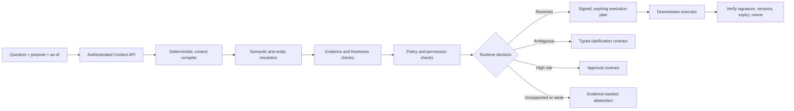

# Lattice architecture

## Ontology-first ownership

The primary ownership boundary is the industry workspace, not an individual contract. The published Lattice Core pack supplies stable cross-industry concepts and each `IndustryWorkspace` materializes Core plus one industry ontology into a deterministic shared foundation. The ontology owns both semantic definitions and reusable master/reference-data bindings. A `ContextContract` references that ontology with `ontologyRef`, declares its `conceptScope`, inherits version-pinned shared bindings for that scope, and owns decision-specific questions, operations, local bindings, evidence, policies, assurance, and releases. Materialization keeps runtime compilation simple: the compiler consumes a pinned snapshot rather than resolving inheritance dynamically.

During the compiler migration, contracts retain embedded `entityTypes` and `relationshipTypes` as compatibility snapshots. Saving the shared ontology synchronizes those snapshots atomically across contracts in the workspace. The intended end state is direct version-pinned ontology resolution by the compiler, after which the embedded fields can be removed.

## Singular product vision

Lattice is a governed context plane between human intent, enterprise meaning, and action. An industry workspace owns the durable semantic foundation; a published **Context Contract** is the deployable decision unit layered on it. It binds together:

- competency questions and answer shapes;
- a version-pinned scope of shared entity and relationship semantics;
- metric definitions and grain;
- source-system operations and permissions;
- evidence, provenance, validity, and strength;
- policy thresholds and approval requirements;
- assurance tests and release state.

This expands the ontology-playground idea into a runtime system. Visual graph editing is the authoring view over the shared ontology; contracts select that meaning and make it testable, publishable, compilable, signed, verifiable, and auditable.

## Compile path



The compiler is pure: it produces an unsigned plan or a non-execution decision. The API is the trust boundary that derives identity, signs plans, stores continuation state, and exposes verification keys.

## Governed schema ingestion

Import Studio treats external schemas as evidence-backed proposals, not authoritative ontology updates. The API parses OpenAPI or JSON Schema, computes a SHA-256 source checksum, converts object schemas and references into draft type proposals, and detects identifier or label collisions against the target contract. The author selects concepts and relationships, edits labels and groups, and resolves each collision as merge, separate type, or skip. Applying a proposal only changes the in-memory unpublished draft and attaches a provenance record; normal draft persistence and release validation remain separate explicit actions.

## Governed source bindings

Source Binding Studio connects a specific source operation to governed meaning. Shared ontology bindings describe reusable master and reference data and are inherited by contracts whose concept scope includes their targets. Contract bindings remain local when a source exists only to answer a particular governed decision. For OpenAPI sources the Studio discovers methods and paths, resolves success-response schemas, flattens nested fields, and suggests ontology-property mappings. Databricks and PostgreSQL can instead discover metadata directly within the declared catalog/schema/object scope. The author reviews type compatibility and declares environment, maximum freshness age, and permissions. Credentials are never stored; declared-schema previews remain offline, while live discovery resolves credential references only in the API process.

The connector catalog generalizes the same contract across Databricks, Microsoft Fabric, Snowflake, BigQuery, PostgreSQL, Kafka, object storage, and OpenAPI. A data-platform binding adds provider and transport identity, a read-only resource scope, parameterized query or selector, and a credential reference resolved by the execution environment. It stores neither a token nor a connection secret. The implemented Databricks adapter combines Unity Catalog metadata with bounded Statement Execution API queries; the implemented PostgreSQL adapter combines `information_schema.columns` with read-only wire-protocol transactions. Other connector templates retain their provider-neutral dispatch boundaries without coupling ontology meaning to a vendor SDK.

This milestone stays single-workspace. Tenant routing, tenant-scoped encryption keys, per-tenant connector inventories, and row-level isolation are explicitly deferred rather than simulated in the contract model.

## Assurance and publish readiness

The Assurance Runner evaluates the current draft rather than relying on manually assigned badges. It checks semantic documentation, relationship endpoints, competency-question operation coverage, required entity context, source-binding availability, relationship paths, mapping targets, runtime declarations, policy coverage, and governance approval state. Runs are append-only JSON artifacts with SHA-256 digests. Studio synchronizes their checks into contract tests and records the run as observation evidence. Publishing independently repeats critical structural, question, binding, and failed-test gates so a UI cannot bypass them.

## Executable policy profiles

Policy Studio maps each operation risk tier to a versioned guardrail profile. A profile declares its owner, minimum evidence strength, maximum evidence age, and whether execution must pause for human approval. Recommended baselines cover only the tiers actually used by the contract. Profiles are governed claims: edits reset them to draft, Review Queue records an independent approval, Assurance proves coverage and validity, and the publish API rejects missing or unapproved profiles. At compile time the same profile can deny ungoverned operations, reject weak or stale evidence, or return an explicit approval requirement before any execution plan is signed.

## Review and approval

Authorship and approval are separate states. Entity types, source bindings, and runtime policies begin as draft claims, can be submitted into an open review, and receive an authenticated decision with a mandatory rationale. Review requests and decisions have independent SHA-256 digests and are append-only; an approved claim that later changes must enter a new review rather than mutate its prior decision. Studio applies decisions back to the contract as approval state plus expert-decision evidence. Assurance reports unapproved claims, while the publish API treats them as hard release blockers.

## Evidence dependency graph

Evidence Registry treats provenance as a navigable dependency graph rather than a document list. It classifies freshness from observation and validity windows, exposes content digests and source locators, and resolves direct dependencies across context objects, relationship assertions, source bindings, governance decisions, and assurance artifacts. This makes the question “what breaks or becomes untrustworthy if this evidence changes?” answerable from the contract itself.

## Immutable release operations

Release Management separates immutable history, the mutable working draft, and runtime activation. Publishing appends a digest-backed release and advances the active pointer. Suspension changes runtime availability without rewriting that artifact. Restoration copies a chosen release into an unpublished draft, leaving both the active pointer and historical digest intact until a new release passes normal review and assurance gates. Contract comparison classifies component additions, removals, and changes into patch, minor, or major impact suggestions.

## Why this is cross-industry

The core types do not encode finance concepts. `ContextContract`, `OperationDefinition`, `EvidenceRecord`, `GuardrailPolicy`, and `SignedExecutionPlan` are reusable. The registry composes the published Core foundation into seven generated industry workspaces; financial-services and energy also include published decision examples:

```text
core runtime
├── Core / Person, Organization, Agent, Document, Event, Location, Asset, Policy
├── financial services / counterparty exposure (implemented example)
├── healthcare / generated ontology pack
├── energy / grid outage response (published end-to-end example)
├── manufacturing / generated ontology pack
├── legal / generated ontology pack
├── insurance / generated ontology pack
└── real estate / generated ontology pack
```

Industry packs should contribute semantics, evidence adapters, policy profiles, tests, and UI presets without forking the compiler.

## Trust boundaries

- `tenantId` and `principalId` are derived from authentication context. Request bodies cannot assert identity.
- The compiler cannot execute source operations.
- Source bindings name permissions and expected result schemas; credentials never enter a contract.
- Plans pin contract, semantic, policy, binding, API, and metric versions.
- Plans are short-lived and signed with Ed25519.
- Executors must reject invalid signatures, expired plans, unexpected contracts, missing permissions, or reused nonces.

The development API uses an ephemeral signing key and a placeholder Bearer-token mapper. Production must replace these with managed KMS/HSM keys, OIDC/JWKS validation, scoped tenant resolution, durable nonce storage, and auditable authorization decisions.

## Current boundaries and intentional gaps

| Area | Starter | Production direction |
|---|---|---|
| Contract store | Atomic local JSON registry with immutable releases, active pointers, suspension, staged restoration, and visual diffs | Multi-tenant transactional database and object storage |
| Authentication | Development Bearer mapper | OIDC/JWKS and server-side tenant membership |
| Signing | Ephemeral process key | KMS/HSM rotation and key history |
| Evidence | Contract-local content-addressed records with freshness and dependency tracing | Append-only evidence ledger with retention, lineage federation, and signed external attestations |
| Policy | Risk-tier profiles with evidence strength, freshness, runtime escalation, review approval, and release gates | Purpose-aware expressions, obligations, policy simulation, and delegated approval workflows |
| Resolution | Deterministic lexical resolver | Governed hybrid resolution with explainable candidate scores |
| Bindings | OpenAPI plus live Databricks/PostgreSQL discovery, native bounded execution, field mappings, schema compatibility, freshness and permission declarations | Remaining sandboxed provider adapters, live health and freshness telemetry |
| Audit | In-memory plan lookup | Tamper-evident resolution, decision, approval, and execution log |
| Assurance | Deterministic draft gates and persistent digest-backed runs | Distributed adapter tests, signed attestations, and policy-specific release thresholds |
| Review | Authenticated rationale-backed decisions with immutable artifacts | Role-based assignments, quorum rules, escalation, and delegated approval authority |

## Microsoft Ontology Playground: adopt and extend

The useful pattern to retain is a low-friction visual environment for exploring ontology objects and relationships. Lattice extends that authoring surface in areas needed for enterprise runtime use:

- a contract as the deployable artifact rather than a graph alone;
- competency-question-first design;
- explicit claim/evidence status separate from approval status;
- governed source bindings and permission requirements;
- first-class tests, release gates, and impact analysis;
- temporal validity and version pinning;
- typed clarification, approval, and abstention outcomes;
- signed, expiring execution plans with verification.

The result is one product loop: **question → model → bind → policy → review → assure → publish → compile → verify → act → audit**.
